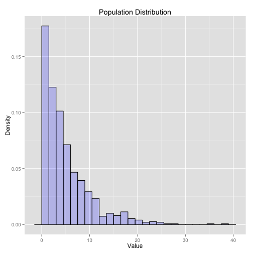

## The Central Limit Theorum is Fun!

The central limit theorem (CLT) allows us to make estimates of statistical properties
of a popluation based on samples from that population.  It states that if you take
subsets of a population of data.  The means of that subsets will be distributed in
a normal distribution around the mean of the popluation with a standard deviation
equal to the standard error.  That is:

$$\mu\left(\bar{x}\right) = \mu$$

and:

$$\sigma\left(\bar{x}\right) = \frac{\sigma}{\sqrt{n}}$$


--- .paragraph-page #page1 

## Seeing is Believeing

My app explores the CLT by simulating an exponentially distributed dataset and then
taking samples of that set and calculating the mean and standard deviation of the
sample means in a similar way to the analysis performed in the Coursera Data Science
Specialization - Statistical Inference course project.  Users are allowed to change
the parameters of:

1. $\lambda$ (the inverse of the ditribution mean)
2. Population
3. Sample Count
4. Sample Size

By changing the values in the system a user can learn about how the central limit
theorem converges to gaussian distributions, even if the data is not in a gaussian 
distribution!

--- 

## Build a Polulation


```r
lambda <- 0.2
poplutaion.count <- 1000
subsample.count <- 1000
subsample.size <- 40
vals <- data.frame(X = rexp(poplutaion.count,lambda));
```



--- 

## Check the Central Limit Theorem

Give a set of parameters the application will generate a histogram of means of 
subsets of the data and will super-impose the CLT predicted normal curve and a 
normal curve fit to the distribution of the sample means for graphical comparison.
Don't take my word for it, [try it for yourself](https://jonathanhines-coursera.shinyapps.io/project/)!


